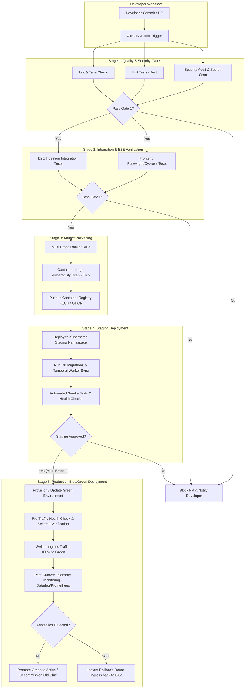

# CI/CD Strategy & Deployment Pipeline Architecture

## 1. Executive Summary & Design Principles

This document outlines the Continuous Integration and Continuous Deployment (CI/CD) strategy for the **Marketing Automation & AI Platform**. Designed for high reliability, zero-downtime deployments, and rigorous quality enforcement, the pipeline automates testing, security scanning, container packaging, staging verification, and production blue/green rollouts.

### Key Pipeline Principles

1. **Shift-Left Quality & Security**: Static code analysis, unit testing, SAST (Static Application Security Testing), and dependency auditing run on every Pull Request before merge.
2. **Immutable Infrastructure**: Production artifacts are built once into immutable OCI-compliant Docker containers, tagged with Git SHA (`${GITHUB_SHA}`), and promoted across environments.
3. **Automated Quality Gates**: Progressive deployment stages require passing health checks, integration tests, and smoke tests before progressing to the next stage.
4. **Zero-Downtime Rollouts**: Production releases leverage **Blue/Green deployments** (with Canary capabilities) managed by Kubernetes Ingress / AWS ALB controllers.
5. **Fast Automated Rollback**: Instant automated traffic shift back to the stable environment if error budgets or performance metrics breach set thresholds.

---

## 2. CI/CD Architecture & Flow Diagram



---

## 3. Comprehensive Stage Breakdown

### Stage 1: Static Analysis, Quality & Security Gates

Ran automatically on every pull request (`pull_request`) and push to feature branches:

- **Linting & Type Checking**:
  - `npm run lint` executing ESLint with strict TypeScript rules (`@typescript-eslint`).
  - `tsc --noEmit` to verify type safety across NestJS backend and React frontend.
- **Unit Testing**:
  - **Backend**: Jest tests covering validation engine (schema checks, date parsing, duplicate detection, business rule validation), API controllers, and reconciliation logic.
  - **Frontend**: React Testing Library component tests covering file upload state management, correction approval toggles, and RAG query input.
  - **Target Metrics**: Minimum 80% code coverage required to pass PR quality gate.
- **Security & Vulnerability Auditing**:
  - **Dependency Audit**: `npm audit --audit-level=high` checks for known CVEs in third-party packages.
  - **Secret Scanning**: **Gitleaks** execution to ensure no API keys (OpenAI, AWS, DB credentials) are accidentally committed.
  - **SAST (Static Application Security Testing)**: **SonarQube / CodeQL** scanning for OWASP Top 10 vulnerabilities (e.g., SQL injection, unsafe deserialization).

---

### Stage 2: Integration & End-to-End Testing

Validates cross-component functionality using containerized micro-services in the CI runner:

- **E2E Ingestion Flow Test**:
  - Spins up ephemeral PostgreSQL (`pgvector`) and Redis services via Docker Compose in GitHub Actions.
  - Uploads synthetic campaign performance CSVs (e.g., `sample.csv`).
  - Verifies Temporal workflow execution, schema validation output, AI semantic matching engine fallback, and reconciliation calculation against stubbed Ad platform endpoints.
  - Asserts DB persistence and PGVector embedding creation for RAG logging.
- **Frontend User Interaction Tests**:
  - **Playwright / Cypress** suite validating end-to-end user workflows:
    1. Selecting file and triggering upload.
    2. Interactive review modal accepting AI confidence suggestions.
    3. Spend reconciliation variance table rendering.
    4. Submitting natural language query in RAG assistant modal and rendering markdown citations.

---

### Stage 3: Artifact Building & Security Scanning

- **Multi-Stage Docker Build**:
  - Utilizes Docker Buildx with layer caching (`type=gha`).
  - Base Image: `node:24-alpine` for minimal surface area and vulnerability exposure.
  - Distroless/Alpine production runner stage eliminating build toolchain (`gcc`, `python`, etc.).
- **Container Image Vulnerability Scanning**:
  - **Trivy / Anchore Grype** scan on the compiled container image before pushing to registry.
  - Rejects build if Critical or High CVEs are detected in the OS layer or Node runtime.
- **Image Tagging & Registry Publish**:
  - Image published to **Amazon ECR** or **GitHub Container Registry (GHCR)**.
  - Tags applied:
    - `${GITHUB_SHA}` (Immutable, traceable commit tag)
    - `vX.Y.Z` (Semantic version tag on release tag creation)
    - `latest` / `staging-latest`

---

### Stage 4: Staging Deployment & Automated Smoke Testing

- **Deployment Mechanism**:
  - Helm chart / Kustomize deployment to Kubernetes `staging` namespace.
- **Database Schema Migration**:
  - Executes TypeORM / Prisma database migrations in an isolated pre-deploy job.
- **Automated Smoke Testing**:
  - Executes automated HTTP checks against `/health` and `/readiness` endpoints.
  - Submits test file payload to `/upload` API and asserts `job_id` status transitions to `COMPLETED`.
  - Asserts response times are within SLA limits (< 2 seconds for API responses).

---

## 4. Production Rollout Strategy: Blue/Green Deployment

For a critical Ad Tech marketing platform handling daily financial and campaign spend data, zero downtime and risk mitigation are essential.

```
                  [ Ingress / ALB Router ]
                             │
            ┌────────────────┴────────────────┐
            │ (100% Traffic)                  │ (0% Traffic)
            ▼                                 ▼
   ┌─────────────────┐               ┌─────────────────┐
   │  Blue Cluster   │               │  Green Cluster  │
   │ (Current v1.1.0)│               │ (New v1.2.0)    │
   └─────────────────┘               └─────────────────┘
            │                                 │
            └────────────────┬────────────────┘
                             ▼
               [ PostgreSQL + PGVector / Redis ]
```

### Blue/Green Execution Steps

1. **Provision Green Environment**: Deploy the new release version (`v1.2.0`) to the inactive "Green" deployment target alongside the active "Blue" target (`v1.1.0`).
2. **Database Migration Safety**: All database schema migrations follow the **Expand/Contract (Parallel Run) Pattern**:
   - _Phase 1 (Expand)_: Non-breaking schema additions (adding nullable columns, new tables). Compatible with both Blue and Green app versions.
   - _Phase 2 (Contract)_: Deprecate old columns only after Green version is fully active and Blue is decommissioned.
3. **Pre-Traffic Verification**: Synthetic health and reconciliation checks run directly against Green internal cluster IP before opening public traffic.
4. **Traffic Cutover**: Ingress controller (Nginx / AWS ALB) flips traffic routing rule from 100% Blue to 100% Green instantaneously (< 1 second DNS/Ingress switch).
5. **Post-Cutover Monitoring Window**: Telemetry (Prometheus, Grafana, Sentry) monitors HTTP error rate (5xx), API latency, and Temporal workflow error rates for 15 minutes.

---

## 5. Rollback Strategy & Disaster Recovery

In the event of unexpected runtime anomalies post-cutover:

### 1. Instant Automated Traffic Switchback

- If automated monitoring detects:
  - HTTP 5xx error rate > **0.5%** over 2 minutes, OR
  - P99 API Latency > **2000ms**, OR
  - Unhandled exceptions in Temporal worker execution,
- The GitHub Actions workflow or AWS Route53/ALB Health Check automatically reverts Ingress traffic back to the **Blue** target (which remains active and idle during the monitoring window).
- **MTTR (Mean Time to Recovery)**: **< 10 seconds**.

### 2. Temporal Workflow State Preservation

- Because long-running ingestion pipelines are managed by **Temporal**, workflow execution history and event logs are maintained in persistent state storage (PostgreSQL/Cassandra).
- Rollback of app containers does _not_ corrupt in-flight ingestion jobs; Temporal workers running on the restored Blue version resume workflow activities from their last recorded checkpoint.

### 3. Database Rollback Safeguards

- Zero destructive migrations (e.g. `DROP COLUMN`) allowed in deployment scripts.
- Rollback migrations (`down.sql`) tested in staging prior to production execution.

---

## 6. Secrets & Environment Configuration

| Setting / Secret                  | Source / Store                        | Management Practice                                                      |
| --------------------------------- | ------------------------------------- | ------------------------------------------------------------------------ |
| Database Credentials              | AWS Secrets Manager / HashiCorp Vault | Injected as environment variables via Kubernetes CSI Secret Store Driver |
| OpenAI / Azure LLM API Keys       | AWS Secrets Manager                   | Rotated automatically every 90 days; no hardcoding in repo or config     |
| Container Registry Credentials    | GitHub Actions Environment Secrets    | Scoped to environment deployment workers with least privilege            |
| Ad Platform API OAuth Credentials | Vault / Secrets Manager               | Environment-specific tokens with granular access scopes                  |

---

## 7. Concrete GitHub Actions Workflow File

The repository contains a fully configured GitHub Actions pipeline in `.github/workflows/ci-cd.yml`:

- **Job `lint-test-and-build`**: Linting, unit tests, security audits, frontend/backend builds, Docker image compilation.
- **Job `deploy-staging`**: Automated deployment and smoke tests against staging cluster.
- **Job `deploy-production`**: Automated Blue/Green deployment with environment approval gates.
